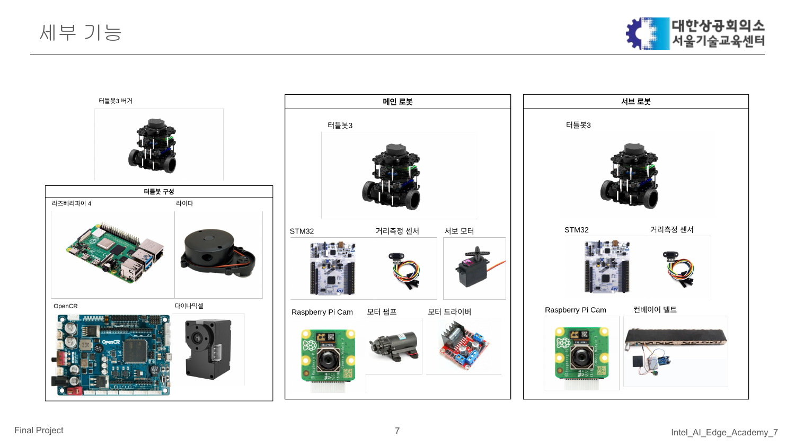
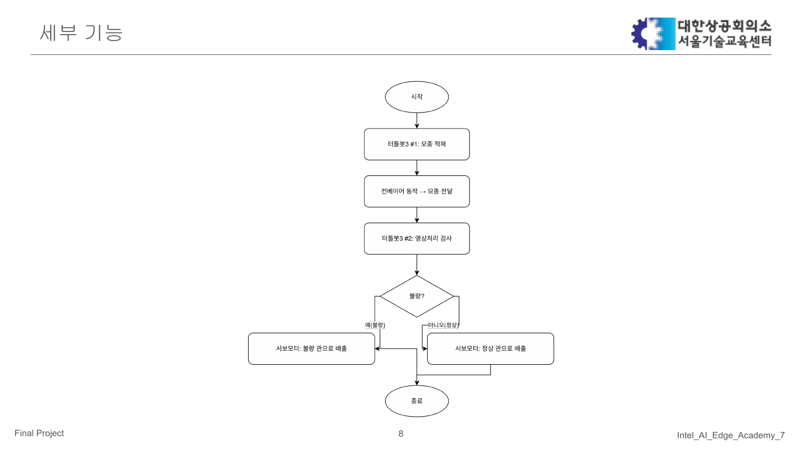

# 인텔 7기 최종 프로젝트 깃허브 #
주제 : 군집을 통한 경장지 관리 자율주행 로봇

## 프로젝트 계획서 요약
- 프로젝트 목표: 차량 군집을 활용해 경작지를 자율적으로 관리하는 시스템을 구축하여 농업 자동화를 실현합니다.
- 추진 배경: 농업 인력 고령화와 생산성 감소로 자동화 수요가 커지고 있으며, 이에 대한 대안으로 자율주행 농기계를 도입하는 방향을 확정했습니다.
- 주요 기술 스택: ROS, Raspberry Pi, STM32, 영상처리 및 AI 등을 결합해 다중 차량 제어와 지능형 의사결정을 구현합니다.
- 역할 분담: 윤치영(팀장) - ROS·Raspberry Pi·STM32, 김재용 - ROS·Raspberry Pi·영상처리/AI, 오민지 - STM32·ROS·영상처리/AI, 황진영 - Raspberry Pi·ROS·영상처리/AI.
- 일정: PPT에 주차별 일정표가 포함되어 있으며, 세부 일정은 원문 계획서를 참고해 주십시오.

### 계획서 주요 슬라이드

